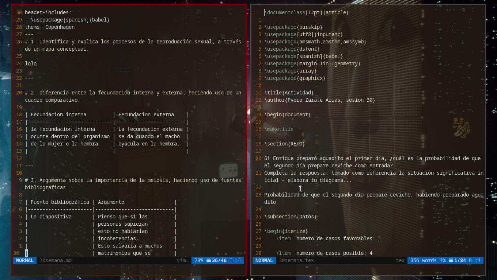

# My config for neovim
My config for neovim.

# I thank those who were inspired to do this config

## Vim y Latex en español

https://www.youtube.com/channel/UCXWMaxXRJ1YtO_2h3UyslXA

## Luke Smith

https://lukesmith.xyz/

# Screenshot for my config

# Themes for beamaner

https://deic-web.uab.cat/~iblanes/beamer_gallery/index.html
